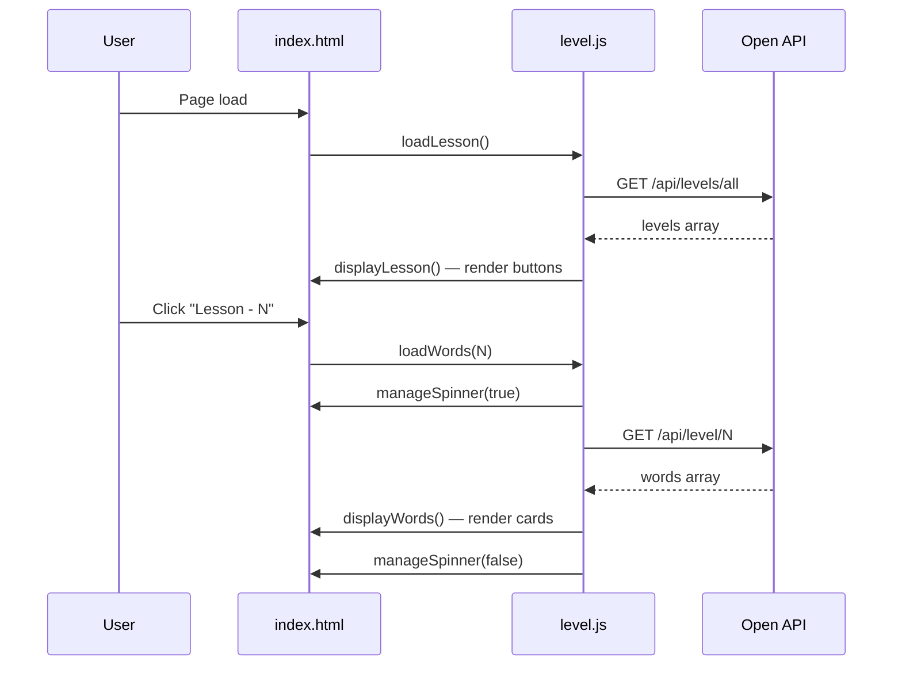

# English Janala — Project Documentation

**Version:** 1.0  
**Live site:** [https://english-janala-ck.pages.dev/](https://english-janala-ck.pages.dev/)  
**License:** MIT

---

## Table of Contents

1. [Introduction](#1-introduction)
2. [System Overview](#2-system-overview)
3. [Technology Stack](#3-technology-stack)
4. [Project Structure](#4-project-structure)
5. [Application Architecture](#5-application-architecture)
6. [User Interface](#6-user-interface)
7. [JavaScript Reference](#7-javascript-reference)
8. [External API](#8-external-api)
9. [Styling Guide](#9-styling-guide)
10. [Installation & Setup](#10-installation--setup)
11. [User Guide](#11-user-guide)
12. [Screenshots](#12-screenshots)
13. [Contributing](#13-contributing)
14. [Acknowledgments](#14-acknowledgments)

---

## 1. Introduction

**English Janala** (ইংরেজি জানালা) is a bilingual English vocabulary learning web application aimed at Bengali-speaking learners. Users can browse lessons by level, study words with meanings and pronunciation, search the full vocabulary catalog, and listen to words via text-to-speech — all through a responsive, mobile-friendly interface.

The app is a static front-end project: no build step, no package manager, and no backend server of its own. All vocabulary data is loaded at runtime from the Programming Hero Open API.

---

## 2. System Overview

### 2.1 Core capabilities

| Feature | Description |
|---------|-------------|
| Lesson levels | Load and switch between vocabulary lessons fetched from the API |
| Word cards | Display word, meaning, and pronunciation in a responsive grid |
| Word details | Modal with pronunciation, meaning, example sentence, and synonyms |
| Pronunciation | Text-to-speech via the Web Speech API |
| Search | Filter the full vocabulary list by keyword |
| FAQ | Collapsible frequently asked questions |
| Bilingual UI | English copy with Bangla (`Hind Siliguri`) where appropriate |


### 2.2 Request lifecycle (lesson load)



---

## 3. Technology Stack

| Layer | Technology | Notes |
|-------|------------|-------|
| Markup | HTML5 | Single-page layout |
| Styling | [Tailwind CSS v4](https://tailwindcss.com/) (CDN) | Utility classes in markup |
| Components | [DaisyUI v5](https://daisyui.com/) | Navbar, buttons, modal, collapse, loading |
| Scripting | Vanilla JavaScript (ES6+) | `fetch`, async/await, DOM APIs |
| Icons | [Font Awesome 7](https://fontawesome.com/) | CDN |
| Fonts | [Poppins](https://fonts.google.com/specimen/Poppins), [Hind Siliguri](https://fonts.google.com/specimen/Hind+Siliguri) | English and Bangla text |
| Speech | Web Speech API | `SpeechSynthesisUtterance` |
| Data | [Programming Hero Open API](https://openapi.programming-hero.com/) | Remote REST JSON |

**Build tooling:** None required. Open `index.html` directly or serve the folder with any static file server.

---

## 4. Project Structure

```
English Janala/
├── index.html              # Main page (navbar, hero, lessons, search, FAQ, footer)
├── style.css               # Custom fonts and active-lesson styles
├── tailwind.init.css       # Tailwind @import entry
├── DOCUMENTATION.md        # This file
├── README.md               # Project overview and quick start
├── scripts/
│   └── level.js            # API calls, UI rendering, search, pronunciation
└── assets/
    ├── logo.png            # Favicon and branding
    ├── heroImg.png         # Hero banner image
    ├── alert-error.png     # Empty lesson state
    ├── hero.png            # README / docs screenshot
    ├── full.png            # README / docs screenshot
    └── words.png           # README / docs screenshot
```

### 4.1 File responsibilities

| File | Responsibility |
|------|------------------|
| `index.html` | Page structure, CDN links, section markup, modal shell, script include |
| `scripts/level.js` | All dynamic behavior: fetching data, rendering UI, events |
| `style.css` | Google Font imports, `.poppins-font`, `.bangla-font`, `.active` lesson state |
| `tailwind.init.css` | `@import "tailwindcss";` for Tailwind browser build |

---

## 5. Application Architecture

### 5.1 Layering

The application follows a simple **presentation + logic** split:

- **Presentation layer** — `index.html` defines static sections and element IDs that JavaScript targets.
- **Logic layer** — `level.js` handles networking, stateless UI updates, and user events.
- **Style layer** — Tailwind/DaisyUI (utility) plus `style.css` (fonts and active button).

There is no framework, router, or state store. DOM content is updated imperatively via `innerHTML` and `appendChild`.

### 5.2 Key DOM hooks

| Element ID | Role |
|------------|------|
| `level-container` | Container for dynamically generated lesson buttons |
| `word-container` | Grid area for vocabulary cards or empty states |
| `spinner` | Loading indicator (shown during fetch) |
| `input-word` | Search input field |
| `btn-search` | Triggers vocabulary search |
| `word_detail_modal` | DaisyUI dialog for word details |
| `details-container` | Modal body populated by `displayWordDetails` |
| `faq` | FAQ section anchor for navbar links |
| `lesson-btn-{id}` | Per-lesson button; receives `.active` when selected |

### 5.3 Initialization

On script load, `loadLesson()` runs immediately (line 154 of `level.js`), which fetches all levels and renders lesson buttons. Search is wired via a click listener on `#btn-search`.

---

## 6. User Interface

### 6.1 Page sections

| Section | Location | Purpose |
|---------|----------|---------|
| Header / Navbar | Top | Branding, FAQ and Learn links (desktop + mobile dropdown) |
| Hero / Banner | Below header | Tagline, Bangla intro copy, hero image |
| Vocabulary lessons | `#level-container` | Lesson level buttons |
| Search | Input + button | Global word search |
| Loading | `#spinner` | DaisyUI loading dots while fetching words |
| Words grid | `#word-container` | Cards or placeholder / empty messages |
| Word modal | `#word_detail_modal` | Extended word information |
| FAQ | `#faq` | Five accordion Q&A items |
| Footer | Bottom | Brand, Bangla tagline, social icons |

### 6.2 Responsive behavior

- Navbar uses a **dropdown menu** on small screens (`lg:hidden`) and horizontal menu on large screens (`hidden lg:flex`).
- Hero uses `flex-col-reverse md:flex-row` for stacked mobile layout.
- Word grid uses `lg:grid-cols-3 md:grid-cols-2` when words are displayed.

### 6.3 Empty and default states

| State | When | UI |
|-------|------|-----|
| No lesson selected | Initial load | Bangla prompt to select a lesson |
| Empty lesson | API returns zero words | `alert-error.png` + Bangla message to try next lesson |
| Search with no matches | Filter yields `[]` | Same empty-lesson UI via `displayWords` |

---

## 7. JavaScript Reference

All functions live in `scripts/level.js`.

### 7.1 `createElements(arr)`

Builds HTML for an array of strings (used for synonym tags).

- **Parameters:** `arr` — array of strings  
- **Returns:** Joined HTML string of `<span class="btn">` elements  

### 7.2 `pronounceWord(word)`

Speaks the given word using the browser’s speech synthesis.

- **Parameters:** `word` — English word string  
- **API:** `SpeechSynthesisUtterance` with `lang: "en-EN"`  
- **Note:** Invoked from inline `onclick` on word cards  

### 7.3 `manageSpinner(status)`

Toggles loading UI visibility.

- **`status === true`:** Show `#spinner`, hide `#word-container`  
- **`status === false`:** Hide spinner, show word container  

### 7.4 `loadLesson()`

Fetches all lesson levels on page load.

- **Endpoint:** `GET https://openapi.programming-hero.com/api/levels/all`  
- **On success:** Calls `displayLesson(lesson.data)`  

### 7.5 `removeActive()`

Removes the `.active` class from all elements with class `lesson-btn`. Used before selecting a new lesson or running search.

### 7.6 `loadWords(id)`

Loads vocabulary for a specific lesson level.

- **Parameters:** `id` — level number (`level_no`)  
- **Endpoint:** `GET /api/level/{id}`  
- **Side effects:** Spinner on → marks button `#lesson-btn-{id}` active → `displayWords(data.data)`  

### 7.7 `loadWordDetails(id)` (async)

Fetches and shows full word details in the modal.

- **Parameters:** `id` — word ID  
- **Endpoint:** `GET /api/word/{id}`  
- **On success:** `displayWordDetails(details.data)`  

### 7.8 `displayWordDetails(word)`

Renders modal content and opens `#word_detail_modal`.

**Expected word object fields:**

| Field | Display |
|-------|---------|
| `word` | Title |
| `pronunciation` | Next to microphone icon |
| `meaning` | Meaning section |
| `sentence` | Example section |
| `synonyms` | Array rendered via `createElements` |

### 7.9 `displayWords(words)`

Renders the vocabulary grid or empty state.

- Clears `#word-container`  
- If `words.length === 0`, shows empty-lesson markup and stops spinner  
- Otherwise adds grid classes and appends one card per word  

**Word card fields used:**

| Field | Fallback |
|-------|----------|
| `word` | `"Word not found"` |
| `meaning` | `"Meaning not found"` |
| `pronunciation` | `"Pronunciation not found"` |
| `id` | Passed to `loadWordDetails` |

### 7.10 `displayLesson(lessons)`

Clears `#level-container` and appends a button per lesson:

```html
<button id="lesson-btn-{level_no}" onclick="loadWords({level_no})" class="btn btn-outline btn-primary lesson-btn">
  Lesson - {level_no}
</button>
```

### 7.11 Search handler

Attached to `#btn-search` click:

1. `removeActive()` on lesson buttons  
2. Read and trim `#input-word`, lowercase for comparison  
3. `GET /api/words/all`  
4. Filter where `word.word.toLowerCase().includes(searchValue)`  
5. `displayWords(filterWords)`  

**Note:** Search does not show the loading spinner; results appear when the full word list fetch completes.

---

## 8. External API

**Base URL:** `https://openapi.programming-hero.com`

### 8.1 Endpoints

| Method | Endpoint | Purpose | Used by |
|--------|----------|---------|---------|
| GET | `/api/levels/all` | List all lesson levels | `loadLesson()` |
| GET | `/api/level/{id}` | Words for a specific level | `loadWords(id)` |
| GET | `/api/word/{id}` | Full details for one word | `loadWordDetails(id)` |
| GET | `/api/words/all` | Complete vocabulary list | Search handler |

### 8.2 Typical response shape

Responses are JSON objects with a `data` property:

```json
{
  "data": [ /* array of levels, words, or word objects */ ]
}
```

Individual word objects (for cards and details) generally include:

- `id`, `word`, `meaning`, `pronunciation`, `sentence`, `synonyms` (array)

Exact schemas are defined by the Programming Hero Open API.

### 8.3 Error handling

The current implementation does not include explicit `catch` blocks on `fetch` calls. Network or API failures may leave the spinner visible (for lesson loads) or produce no UI update (for search). Extending with `.catch()` and user-facing error messages is a recommended improvement.

---

## 9. Styling Guide

### 9.1 Custom classes (`style.css`)

| Class | Purpose |
|-------|---------|
| `.poppins-font` | Default body font (English UI) |
| `.bangla-font` | Hind Siliguri for Bangla text |
| `.active` | Selected lesson button: purple background `#422AD5`, white text |

### 9.2 Brand colors (inline / Tailwind)

| Usage | Color |
|-------|-------|
| Accent / highlights | `#00BCFF` |
| Body text | `#18181B`, `#292524`, `#79716B` |
| Card action buttons | `#1A91FF1A` (light blue tint) |
| Footer border | `#FFEBEB` |

### 9.3 CDN dependencies (in `index.html`)

- Font Awesome 7.0.1 (cdnjs)  
- DaisyUI 5 (jsDelivr)  
- Tailwind CSS browser v4 (jsDelivr)  

---

## 10. Installation & Setup

### 10.1 Prerequisites

- A modern web browser (Chrome, Firefox, Edge, Safari)  
- Optional: a local static file server if you encounter `file://` CORS limitations  

### 10.2 Run locally

**Open directly**

Double-click `index.html` or open it from the browser File menu.


### 10.3 Deploy

The production build is static files only. The project is deployed at:

**[https://english-janala-ck.pages.dev/](https://english-janala-ck.pages.dev/)**

Compatible hosts include Cloudflare Pages, Netlify, GitHub Pages, or any static hosting service.

---

## 11. User Guide

### 11.1 Getting started

1. Open the [live demo](https://english-janala-ck.pages.dev/) or run the project locally.  
2. Scroll to **Let's Learn Vocabularies** or use **Learn** in the navbar.  
3. Click a **Lesson** button to load words for that level.  

### 11.2 Studying words

| Action | How |
|--------|-----|
| View meaning & pronunciation | Shown on each card after loading a lesson |
| Full details | Click the **info** (circle-info) button on a card |
| Hear pronunciation | Click the **speaker** (volume-high) button |
| Close details | Click **Complete leaning** in the modal |

### 11.3 Searching

1. Type a word (or partial word) in **Search Word Now**.  
2. Click **Search**.  
3. Matching cards appear across all lessons (lesson highlight is cleared).  

### 11.4 FAQ

Use **FAQ** in the navbar to jump to common questions about starting, cost (free), accounts, vocabulary tips, and certificates.


---

## 12. Contributing

1. Fork the repository  
2. Create a feature branch: `git checkout -b feature/your-feature`  
3. Commit your changes: `git commit -m "Add your feature"`  
4. Push to the branch: `git push origin feature/your-feature`  
5. Open a Pull Request  

When adding features, prefer extending `level.js` with small, named functions and matching existing Tailwind/DaisyUI patterns in `index.html`.

---

## 13. Acknowledgments

- [Programming Hero](https://www.programming-hero.com/) — Open API and course context  
- [DaisyUI](https://daisyui.com/) — UI components  
- [Tailwind CSS](https://tailwindcss.com/) — Utility-first styling  

---
