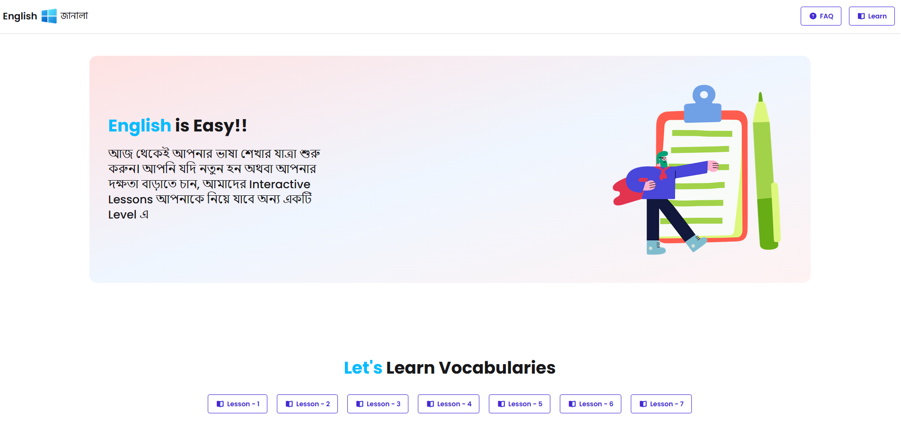
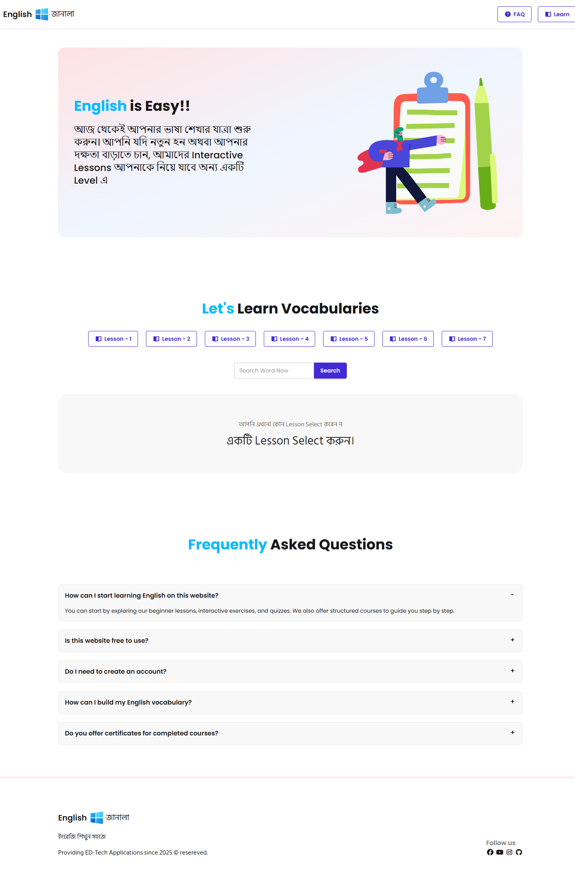
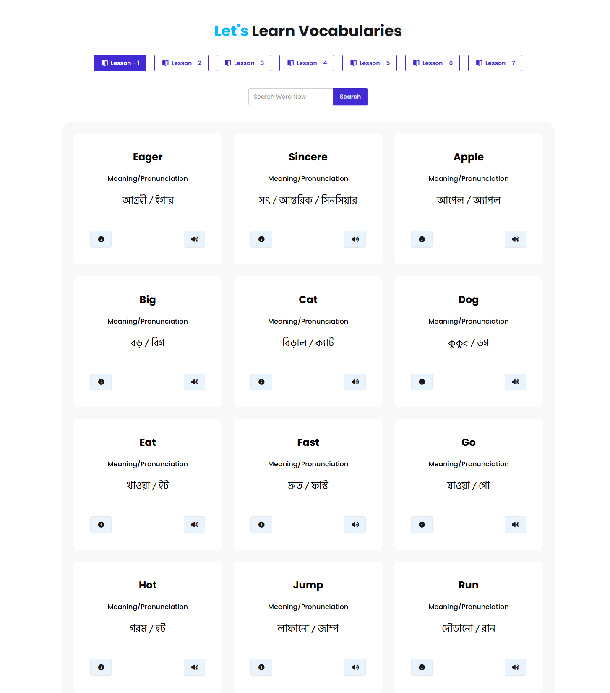

# English Janala (ইংরেজি জানালা)

A bilingual English vocabulary learning web app for Bengali-speaking learners. Browse lessons by level, explore words with meanings and pronunciation, search the full vocabulary list, and hear words spoken aloud — all in a simple, responsive interface.


## Live Demo

Open `index.html` in your browser, or visit the live link [English Janala](https://english-janala-ck.pages.dev/).

## Features

- **Lesson levels** — Load and switch between vocabulary lessons fetched from the API
- **Word cards** — View word, meaning, and pronunciation in a responsive grid
- **Word details** — Modal with pronunciation, meaning, example sentence, and synonyms
- **Pronunciation** — Text-to-speech via the Web Speech API
- **Search** — Filter the full vocabulary list by keyword
- **FAQ** — Collapsible frequently asked questions
- **Bilingual UI** — English copy with Bangla (`Hind Siliguri`) where appropriate

## Tech Stack

| Layer | Technology |
|-------|------------|
| Markup | HTML5 |
| Styling | [Tailwind CSS v4](https://tailwindcss.com/) (CDN), [DaisyUI v5](https://daisyui.com/) |
| Scripting | Vanilla JavaScript (ES6+) |
| Icons | [Font Awesome 7](https://fontawesome.com/) |
| Fonts | [Poppins](https://fonts.google.com/specimen/Poppins), [Hind Siliguri](https://fonts.google.com/specimen/Hind+Siliguri) |
| Data | [Programming Hero Open API](https://openapi.programming-hero.com/) |

No build step or package manager is required.

## Project Structure

```
English Janala/
├── index.html          # Main page (navbar, hero, lessons, search, FAQ, footer)
├── style.css           # Custom fonts and active-lesson styles
├── tailwind.init.css   # Tailwind import
├── scripts/
│   └── level.js        # API calls, UI rendering, search, pronunciation
└── assets/             # Images (logo, hero, empty-state)
    ├── logo.png
    ├── heroImg.png
    └── alert-error.png
```

## API Endpoints Used

| Endpoint | Purpose |
|----------|---------|
| `GET /api/levels/all` | List all lesson levels |
| `GET /api/level/{id}` | Words for a specific level |
| `GET /api/word/{id}` | Full details for one word |
| `GET /api/words/all` | All words (used for search) |

Base URL: `https://openapi.programming-hero.com`

## Getting Started

### Prerequisites

- A modern web browser (Chrome, Firefox, Edge, Safari)
- Optional: a local static file server (recommended to avoid CORS issues with `file://`)

### Run locally

**Open directly**

Double-click `index.html` or open it from your browser’s File menu.


### Usage

1. Click a **Lesson** button to load vocabulary for that level.
2. Use **Search** to find words across all lessons.
3. Click the **info** icon on a card to open word details (meaning, example, synonyms).
4. Click the **speaker** icon to hear the word pronounced.
5. Use **FAQ** in the navbar for common questions.

## Screenshots



---


---


---

## Contributing

1. Fork the repository
2. Create a feature branch (`git checkout -b feature/your-feature`)
3. Commit your changes (`git commit -m "Add your feature"`)
4. Push to the branch (`git push origin feature/your-feature`)
5. Open a Pull Request

## License

This project is under **MIT License**.

## Acknowledgments

- [Programming Hero](https://www.programming-hero.com/) — Open API
- [DaisyUI](https://daisyui.com/) — UI components
- [Tailwind CSS](https://tailwindcss.com/) — utility-first styling
